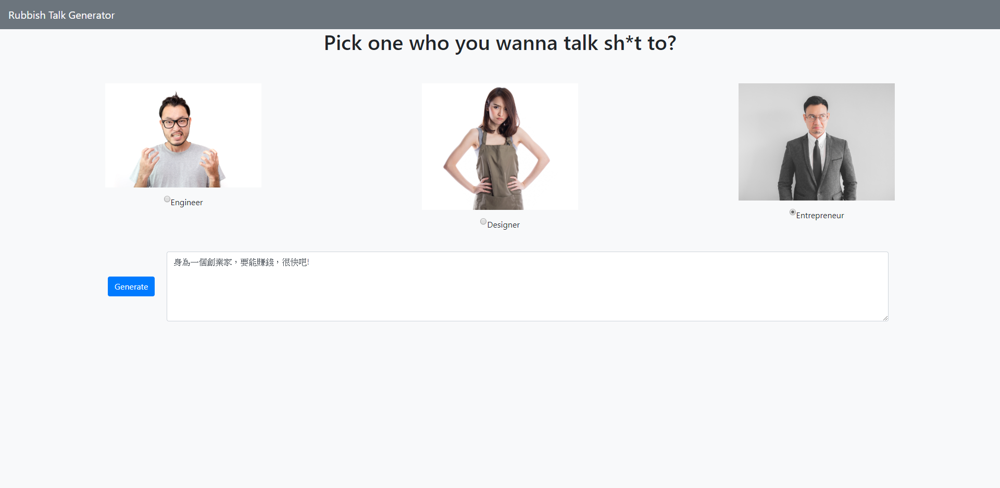

# Rubbish Talk Generator

This is a **Rubbish Talk Generator** demo which built up from [Alphacamp](https://tw.alphacamp.co/) semester 3 assignment.




## Installing

### Git bash

#### git clone

`git clone` to clone the project

```markdown
git clone https://github.com/mpragnarok/rubbish-talk.git
```

### Command line

#### npm install

Install all the packages in the project.

#### npm run dev

Start the server with **nodemon** command.

#### npm run start

Start the server with node command.

#### CTRL + C twice

Stop the server

### Browser

Head to [http://localhost:3000](http://localhost:3000) to experience the restaurant list demo.

## Feature

​	The main feature is to generate rubbish talk for engineer, designer and entrepreneur. Front-end part is written in **JavaScript**, **CSS** and **HTML**, back-end part is written in **Node.js** and **Express.js**.

## packages

#### dependencies

1. express
2. express-handlebars

#### devDependency

1. nodemon